# File Hash Value Generator
This Java Swing GUI Tool allows users to generate the unique Hash Value of a specified file on thier machine. Hashing is an algorithm used in order to calculate a fixed-size Hexidecimal Representation of a file. Each file is composed of multiple blocks of data which can be read and condensed down into smaller segments. These segments are then further condensed until a single hexidecimal byte of data is calculated. From here, depending on the Hashing Algorithm used, the newly calculated bytes are finally condensed down into a fixed-size string of data having the character length associated with the user's chosen Hashing Algorithm Type.

This Application Features Several Different Hash Algorithm Formulas:

*     MD2         -       128-bit (32 Character) Message Digest Hash [For 8-bit Machines]
*     MD5         -       128-bit (32 Character) Message Digest Hash [For 128-bit Machines]
*     SHA-1       -       160-bit (40 Character) Secure Hashing Algorithm Hash
*     SHA-224     -       224-bit (56 Character) Secure Hashing Algorithm Hash
*     SHA-256     -       256-bit (64 Character) Secure Hashing Algorithm Hash
*     SHA-348     -       338-bit (96 Character) Secure Hashing Algorithm Hash
*     SHA-512       -     512-bit (128 Character) Secure Hashing Algorithm Hash

Each Hash Algorithm Type will produce a unique string of Hexidecimal Characters that differs from the output of the other selection options. The user only needs to select a different Hashing Algorithm before clicking the "Compute Hash" Button in order to see the result. This Application is capable of calculating the Hash Value of any type of file. Additionally, it is built with warning / error catching functionality which is used to explain to the user the exact reason why an error has occurred in the calculation process.
Screenshots of the Application Functioning are shown below.

*(**Note:** This Application was Designed and Tested Using the **Apache Netbeans 11.2** Integrated Development Environment)*

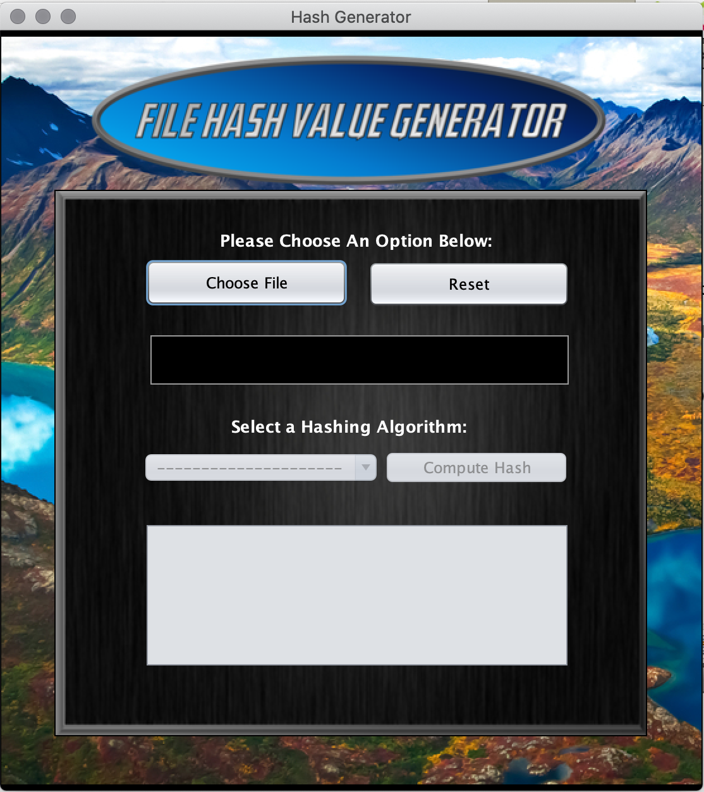

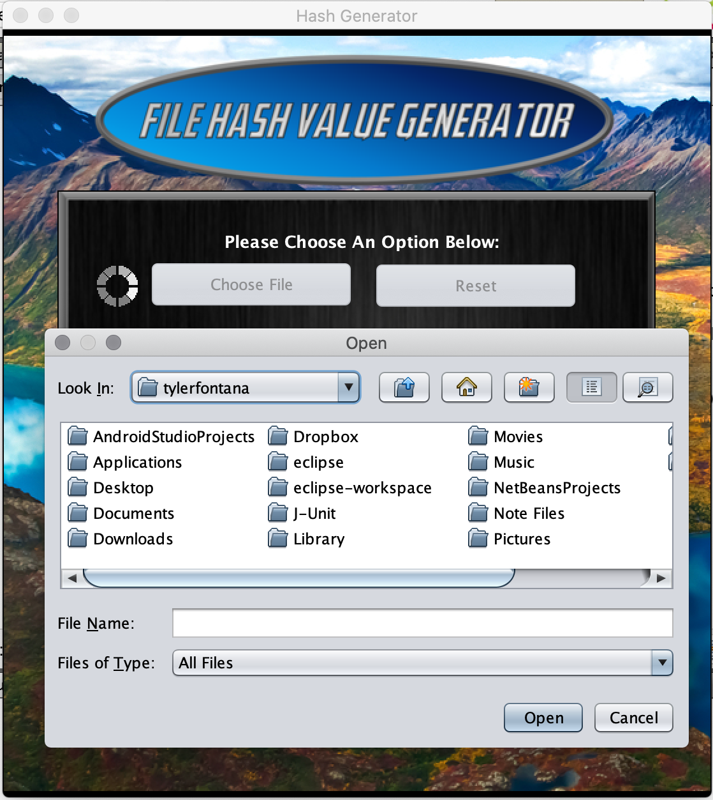

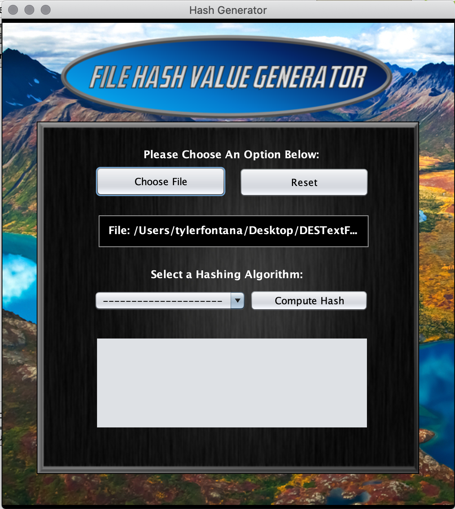

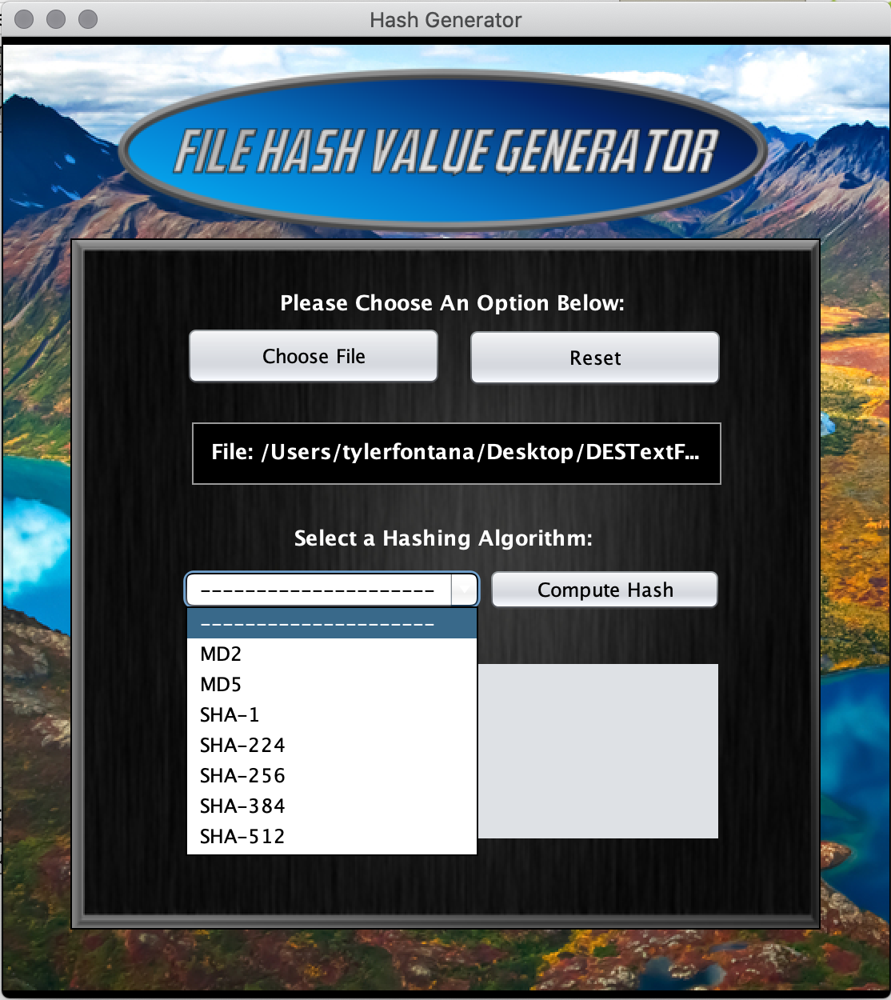

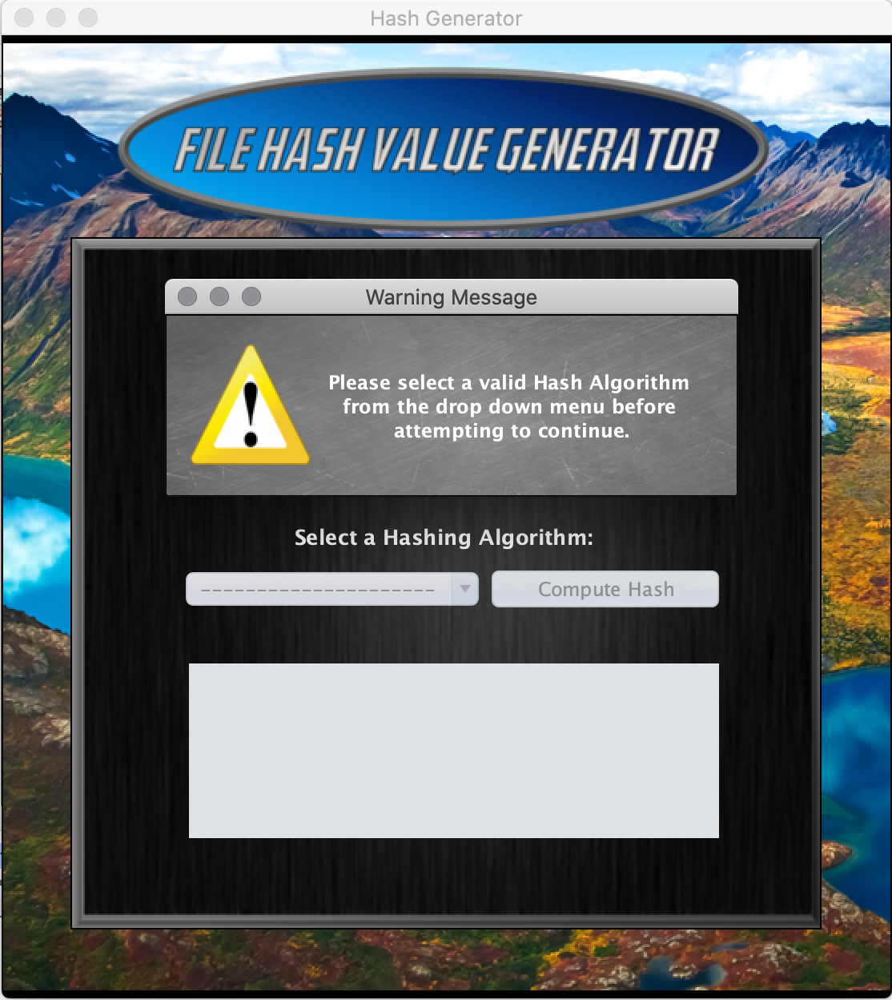

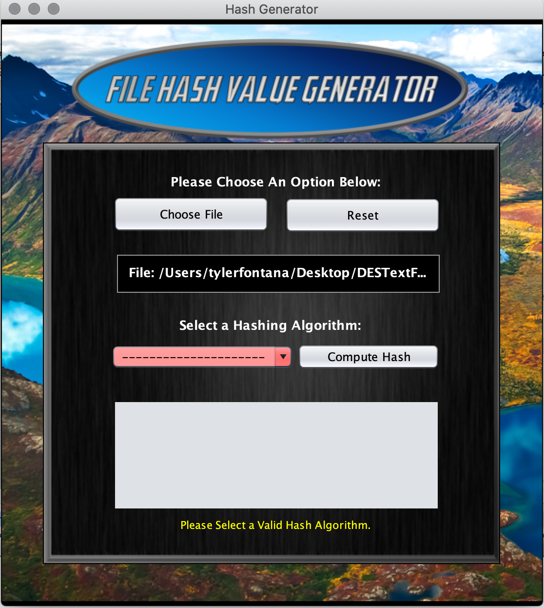

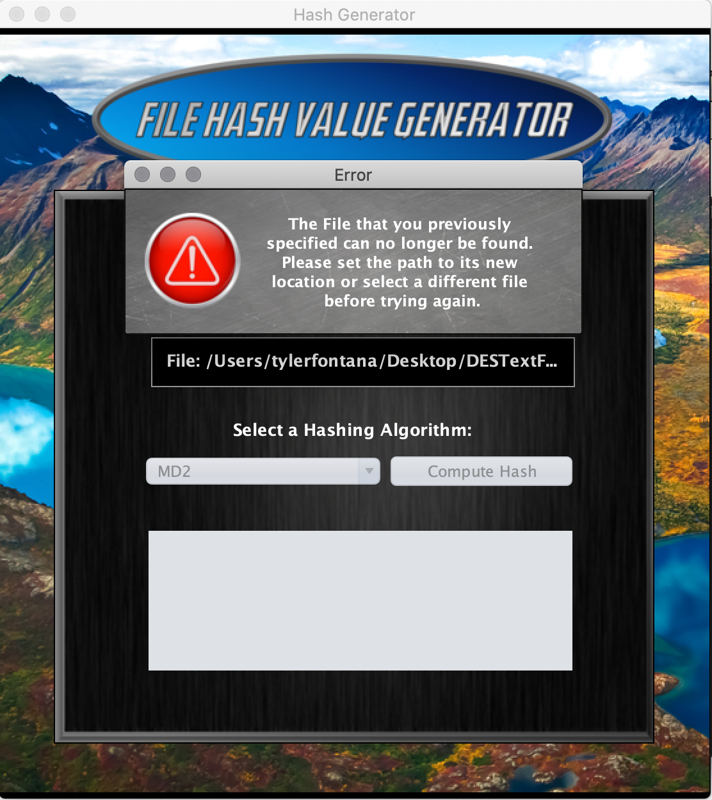

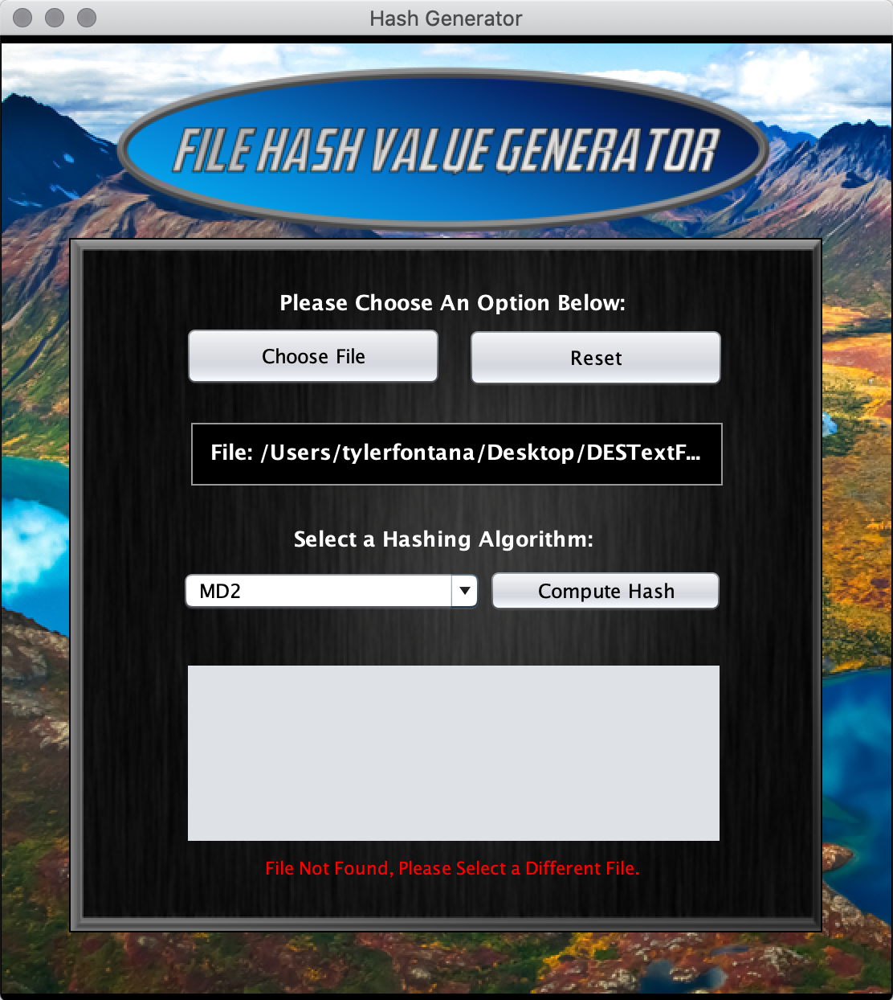

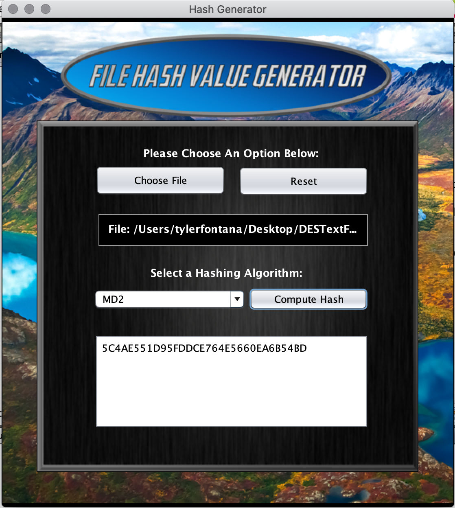

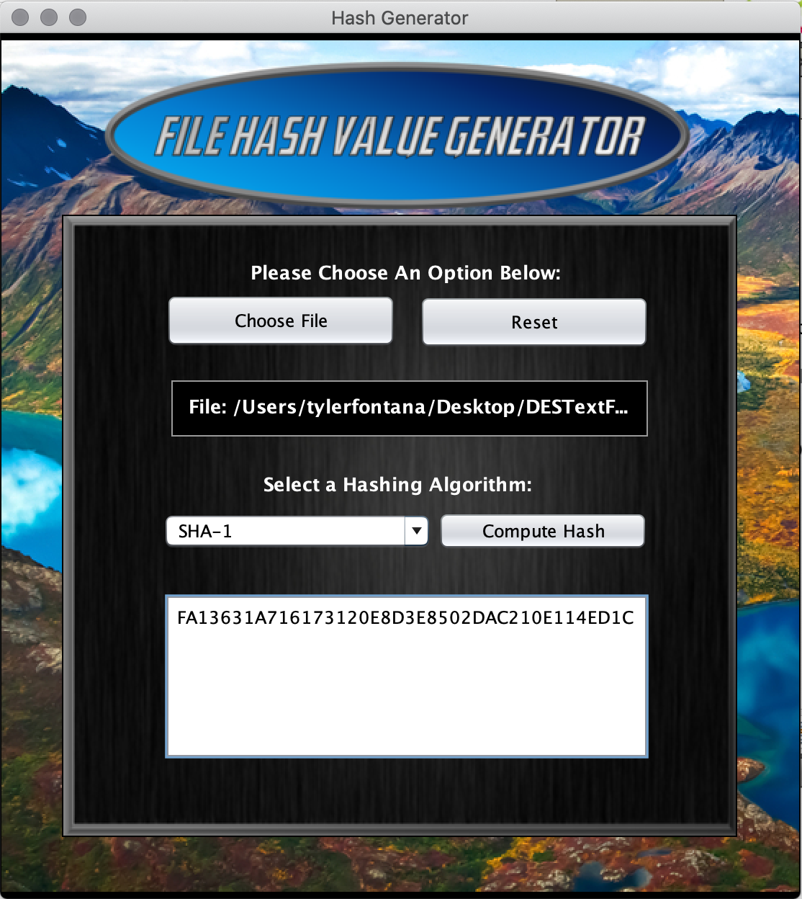

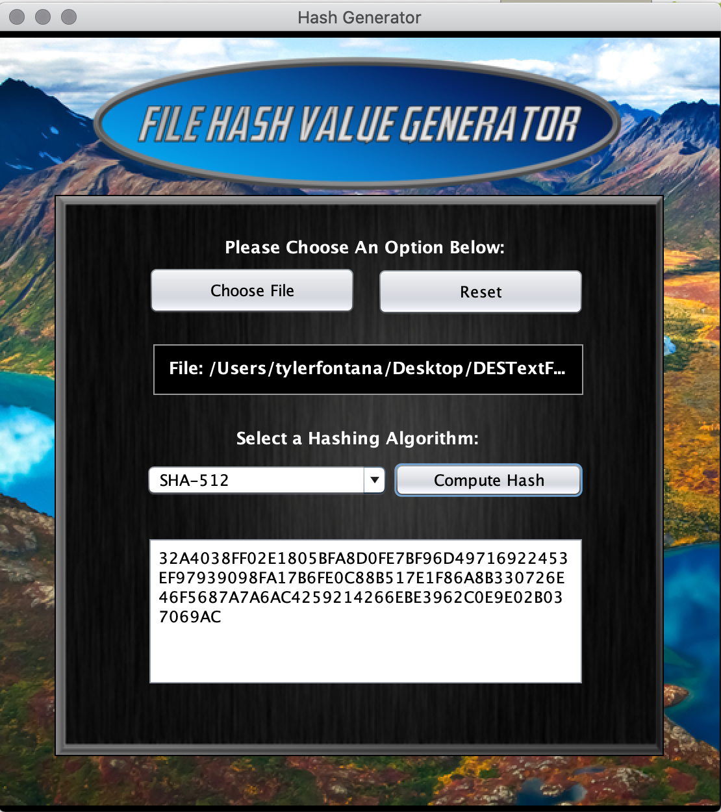

